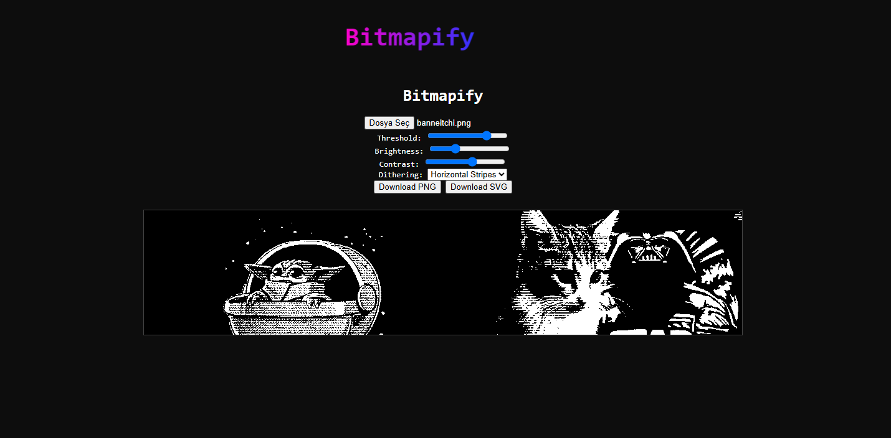
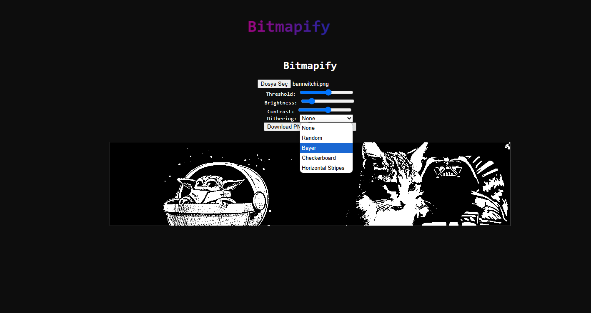
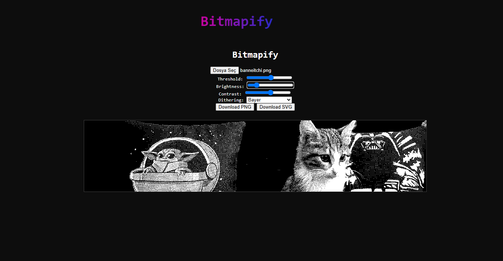
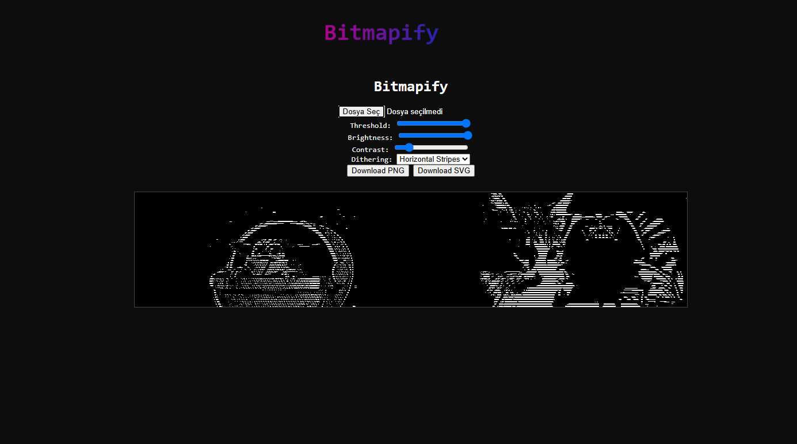
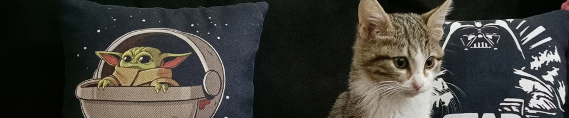
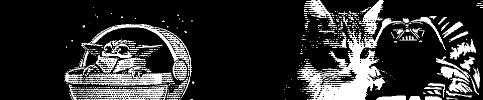

# 🖼️ Bitmapify

**Bitmapify** is a free, open-source browser-based tool that transforms any image into stunning black-and-white bitmap art with customizable dithering effects.

Live Demo: [https://kenanaegean.github.io/Bitmapify-Image-Dithering/](https://kenanaegean.github.io/Bitmapify-Image-Dithering/)

---

## ✨ Features

- 🎨 Adjustable **threshold**, **brightness**, and **contrast**
- 🌀 Choose from 5 **dithering methods**:
  - None
  - Random
  - Bayer
  - Checkerboard
  - Horizontal Stripes
- 📤 Upload any image (PNG, JPG, WEBP)
- 📥 Download result as **PNG** or **SVG**
- ⚡ Instant preview with live rendering
- 🧠 Fully client-side (no server, no data uploaded)

---

## 📸 Screenshots

| Screenshots | Screenshots |
|----------|-----------|
|  |  |
|  |  |

---

## 🛠️ Tech Stack

- HTML5 + CSS3
- JavaScript (Canvas API)
- SVG Serialization

---

## 💡 Inspired By

Retro bitmap art, threshold filters, and old-school photo copiers.

---

## 📄 License

MIT License — feel free to use and remix!

---

**Made with ❤️ by [Kenan Ege](https://github.com/KenanAegean)**
